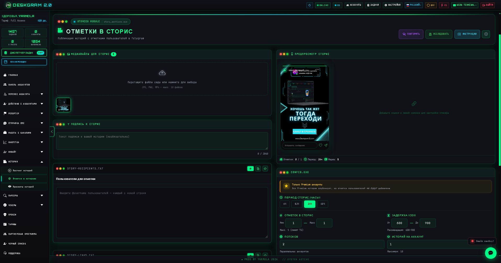
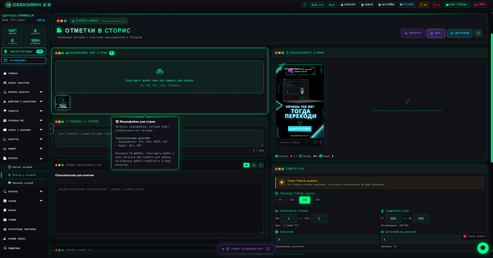
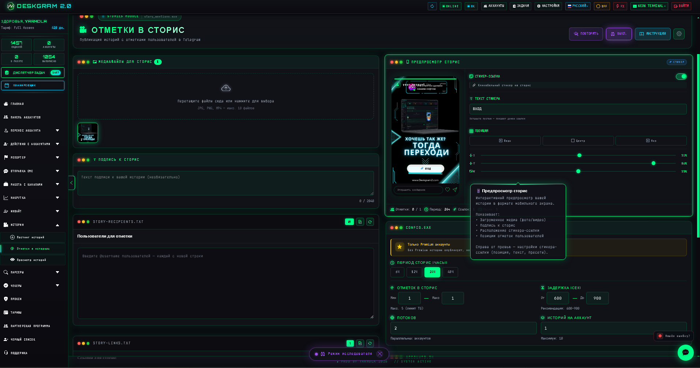
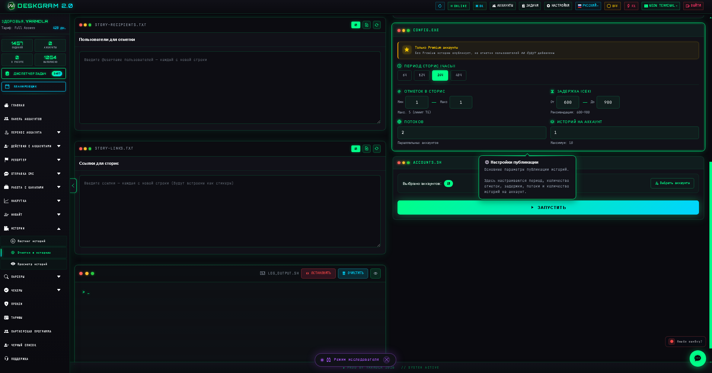

# Отметки в Telegram Stories через Deskgram 2

Deskgram 2 помогает запускать stories-сценарии с отметками в Telegram: готовить медиа, выбирать получателей, настраивать логику публикации и выстраивать social-layer вокруг аккаунтов. Этот модуль полезен, когда вы хотите усиливать охват через stories, делать более “живую” активность и расширять контентную воронку за пределы обычных постов.

[Deskgram 2 Telegram Automation](https://github.com/Deskgram-2/deskgram-2-telegram-automation) • [Сайт](https://deskgram2.com/) • [Telegram-бот](https://t.me/DG2welcomebot) • [Web preview](https://deskgram2.com/web-preview?path=%2Fapp-demo%2Ffunctions%2Fstory_mentions&lang=ru)

## Посмотреть модуль в браузере

Если хотите сначала посмотреть интерфейс, откройте [web preview модуля отметок в stories](https://deskgram2.com/web-preview?path=%2Fapp-demo%2Ffunctions%2Fstory_mentions&lang=ru). Так проще понять, как устроены медиа, список получателей и ключевые настройки публикации.

## Скриншоты

## Когда модуль особенно полезен

| Сценарий | Что дает модуль |
|---|---|
| Нужно усилить social-layer вокруг аккаунтов | Stories добавляют дополнительный канал активности |
| Нужно расширить охват контента за пределы постов | Помогает использовать stories как отдельный формат |
| Нужен более “живой” контур вокруг аккаунтов | Stories хорошо дополняют warmup и content-сценарии |
| Нужно делать отметки и связки между участниками | Помогает строить взаимодействие через stories-формат |

## Что умеет модуль

- запускать публикации stories с отметками в Telegram;
- работать с медиа и списками получателей;
- настраивать логику публикации stories как отдельного слоя активности;
- дополнять контентные и growth-сценарии stories-механикой;
- формировать более широкий social-footprint вокруг аккаунтов.

## Как обычно используют stories с отметками

1. Готовят визуалы и сценарий stories.
2. Определяют, кого и в каком контексте нужно отмечать.
3. Настраивают параметры публикации и пул аккаунтов.
4. Проверяют, как stories вписываются в общую activity-цепочку.
5. Запускают stories-поток как самостоятельный или дополнительный social-layer.

## Что подключить рядом

- [Просмотр stories](https://github.com/Deskgram-2/telegram-story-viewer-deskgram), если нужно не только публиковать stories, но и наращивать stories-активность;
- [Прогрев аккаунтов](https://github.com/Deskgram-2/telegram-account-warmup-deskgram), если stories идут как часть мягкого warmup;
- [Панель аккаунтов](https://github.com/Deskgram-2/telegram-account-manager-deskgram), чтобы выбирать аккаунты для stories-сценариев;
- [Прокси-менеджер](https://github.com/Deskgram-2/telegram-proxy-manager-deskgram), если stories запускаются с сеткой аккаунтов;
- [Настройки автоматизации](https://github.com/Deskgram-2/telegram-automation-settings-deskgram), чтобы выровнять технические параметры запуска.

## Как читать интерфейс модуля

### Главный экран

Здесь собирается логика stories-сценария: какие аккаунты участвуют, какое медиа используется и как устроена сама публикация.

### Медиа и получатели

Это важный блок для практической настройки. Здесь определяется, что именно уходит в stories и кто участвует в отмечаемой цепочке.

### Настройки

В этом блоке задается ритм stories-потока, технические параметры и правила выполнения сценария.

## Что важно настроить в первую очередь

- качество и формат stories-медиа;
- список получателей и роль отметок;
- аккаунты, с которых идет stories-активность;
- темп и плотность публикации;
- место stories в общей content- или growth-цепочке.

## Типовые сценарии использования

### Stories как дополнительный social-layer

Когда обычных постов уже недостаточно, stories помогают добавить еще один вид активности и сделать аккаунты менее “плоскими” по поведению.

### Stories в связке с warmup

Если аккаунты проходят [прогрев](https://github.com/Deskgram-2/telegram-account-warmup-deskgram), stories могут стать дополнительным мягким действием в общей activity-схеме.

### Stories как часть контентного контура

Stories можно использовать не изолированно, а вместе с [постингом по каналам](https://github.com/Deskgram-2/telegram-channel-posting-deskgram), чтобы контент работал в нескольких форматах сразу.

## Что выбрать рядом

| Задача | Что выбирать |
|---|---|
| Нужно запускать stories с отметками | Отметки в stories |
| Нужно сначала наращивать stories-активность | [Просмотр stories](https://github.com/Deskgram-2/telegram-story-viewer-deskgram) |
| Нужно усилить общий контентный поток | [Постинг по каналам](https://github.com/Deskgram-2/telegram-channel-posting-deskgram) + stories |
| Нужен более безопасный запуск stories на сетке аккаунтов | Stories + [прогрев аккаунтов](https://github.com/Deskgram-2/telegram-account-warmup-deskgram) |

## Почему это сильнее, чем вести только посты

| Подход | Что обычно получается |
|---|---|
| Работать только через посты | Контентный слой остается более узким |
| Добавить stories | Появляется дополнительный social-format |
| Связать stories с warmup и content-flow | Поведение аккаунтов выглядит богаче и гибче |

## Related repositories

- [Deskgram 2 Telegram Automation](https://github.com/Deskgram-2/deskgram-2-telegram-automation)
- [Просмотр stories](https://github.com/Deskgram-2/telegram-story-viewer-deskgram)
- [Прогрев аккаунтов](https://github.com/Deskgram-2/telegram-account-warmup-deskgram)
- [Панель аккаунтов](https://github.com/Deskgram-2/telegram-account-manager-deskgram)
- [Прокси-менеджер](https://github.com/Deskgram-2/telegram-proxy-manager-deskgram)
- [Постинг по каналам](https://github.com/Deskgram-2/telegram-channel-posting-deskgram)

## FAQ

### Stories с отметками нужны только для медиа-активности?

Нет. Они могут быть частью broader-flow: warmup, content, social-layer и общей активности аккаунтов.

### Лучше сначала запускать просмотр stories или сразу отметки?

Если нужен более мягкий вход, чаще логичнее сначала построить activity-layer через просмотр stories, а потом усиливать его отметками.

### Можно ли использовать модуль вместе с постингом?

Да. Это одна из лучших связок для более широкого контентного контура в Telegram.
